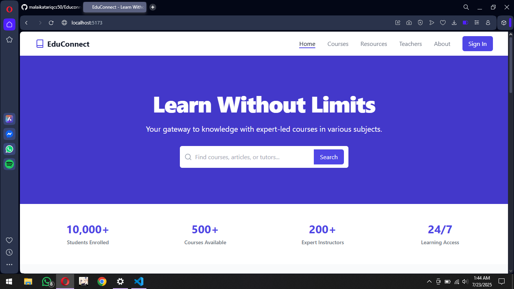
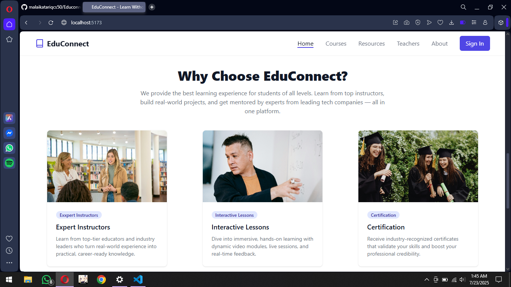
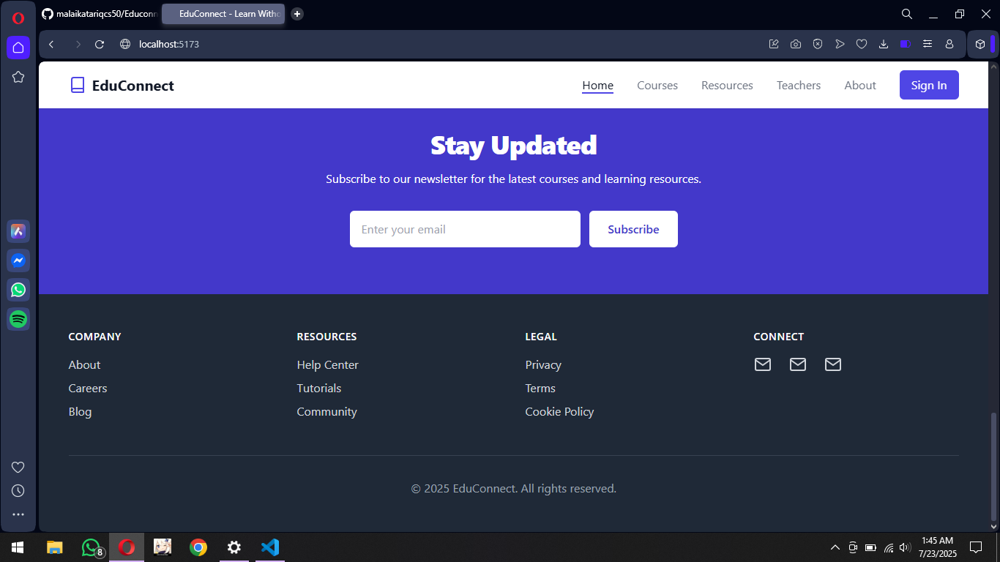
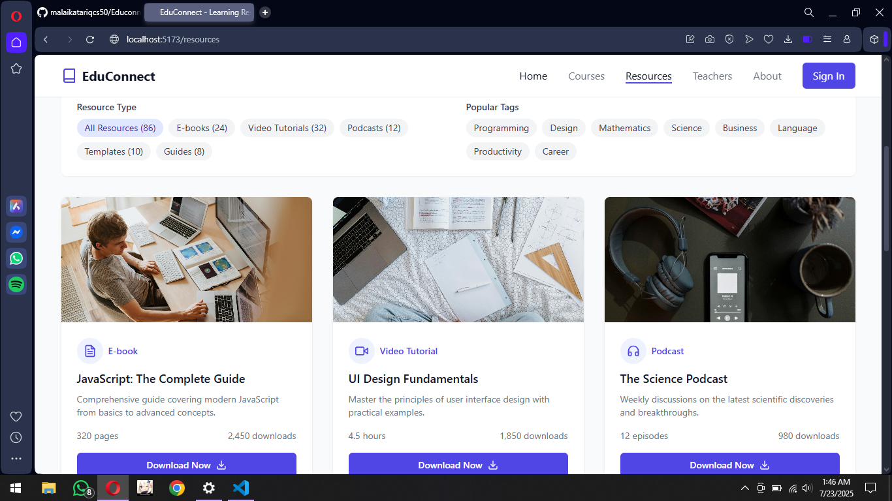
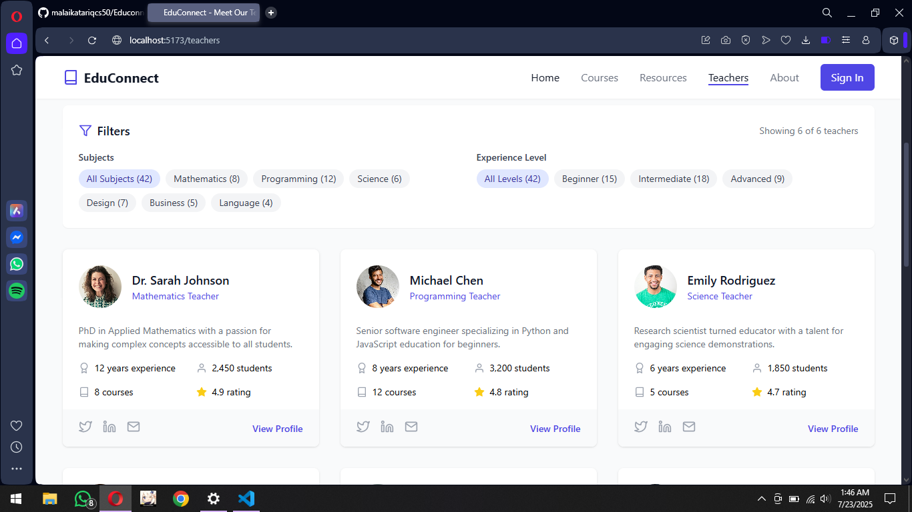

# EduConnect 📚✨  

**A modern online learning platform** that connects students with expert-led courses in programming, math, science, and more. Features **interactive lessons, progress tracking, and certifications**—all wrapped in a sleek, animated UI. Designed for **self-paced upskilling**, it combines **quality education** with **community-driven learning**. Perfect for students, professionals, and lifelong learners.  

👉 *Learn without limits.*  

## Courses

## Resources

## Dummy Teachers
